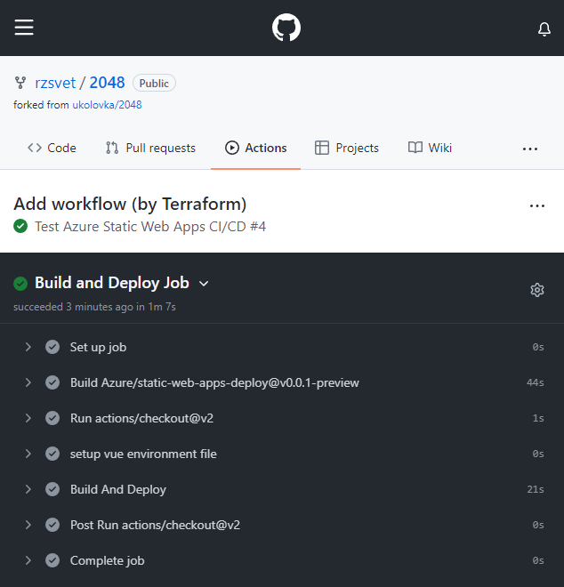

# DevOps Internship: Azure Task 3
## Hometask

1. Create a Web App service plan.
2. Create a Web App with source code from some git repo with simple web application (such us hello world or else basic content).

## Solution

The task is completely solved with the help of Terraform

Components:
* Azure
    * Resource group
    * Static site

* Github
    * Actions secret
    * Repository file




## Terraform Commands
### Azure Authentication

```bash
az login
```

### Create
```bash
terraform init
terraform plan -out main.tfplan
terraform apply main.tfplan
```

### Destroy
```bash
terraform plan -destroy -out main.destroy.tfplan
terraform apply main.destroy.tfplan
```